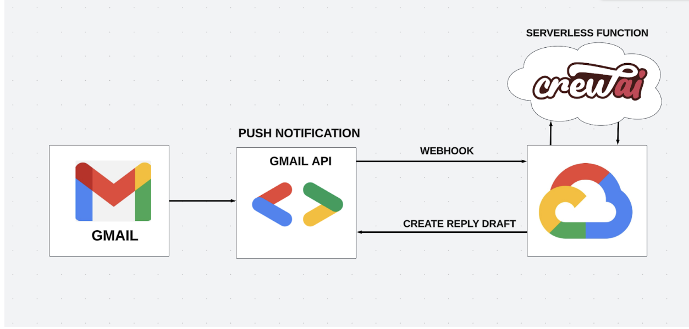

# Gmail Automation using AI Agents

## Introduction
This project aims to automate the email checking and drafting emails. 
With the help of Crew AI multiple agents can be collaborated and automated to handle and solve complex tasks efficiently.

## Implementation
- **Configure the environment**: Setup the environment variables in a `.env` file.
- **Credentials for Gmail**: Setup the Google account OAuth credentials in a `credentials.json` file.
- **Dependcies**: Install the dependencies required by running `pip install -r requirements.txt` in the terminal.
- **Executing**: Run `python main.py` to execute the script.

## Future Work
Currently, it runs once on executing the script. But to implement complete automation pair it with LangGraph or Apache airflow to run the process when a new email comes in or at a scheduled time interval.
